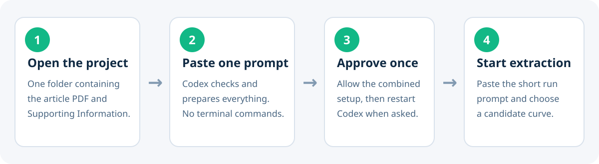

# ECD Spectra

Codex plugin for precise, auditable extraction and standardization of
experimental electronic circular dichroism (ECD/CD) spectra and their
measurement conditions from scientific literature.

The plugin contains the `extract-ecd-spectra` skill. It prioritizes original
numerical data and vector recovery, supports raster tracing when appropriate,
and requires human confirmation of chemical identity, calibration, sign, and
the final extraction overlay. During execution it shows numbered progress,
figure crops, calibration views, isolated curves, and curve-level overlays.
Each completed spectrum package includes a self-contained visual HTML report
and a Markdown report; neither requires a server or network connection. It
preserves the reported solvent description and
also records structured solvent components, mixture ratios, provenance,
concentration, path length, temperature, and other available acquisition
conditions needed for subsequent simulation.

For multi-curve plots, the raster extractor preserves trace color identity,
rejects chromatic pixels when following black or gray curves, suppresses dense
vertical plot geometry, and records these decisions in the final report.
Ambiguous same-color crossings remain a supervised WebPlotDigitizer or Engauge
task.

The package also records stereochemical evidence from the article and
supporting information: crystal-structure availability and deposition
identifiers, absolute-structure refinement data, chemical or synthetic
correlations, chiroptical comparisons, optical rotation, and chromatographic
evidence. Each observation is linked to its source and to the measured sample;
spectral quality and stereochemical-assignment confidence are assessed
separately.

## Before you start

Choose a paper that contains experimental ECD spectra. Download both the
article and its Supporting Information as PDF files and put them together in a
new folder. The solvent, compound structure, and identity of the curve must be
clear in the paper; the plugin will stop when any of these links is ambiguous.

If you prefer a prepared training case, use the
[oxo-helicene example](examples/acs-omega-oxohelicene/README.md).

## Install in Codex from GitHub



1. Install the Codex desktop app.
2. Put the article PDF and its Supporting Information PDF in one folder.
3. Open that folder as a project in Codex.
4. Paste:

```text
Prepare this project to use ECD Spectra from
https://github.com/marcostrasto/ecd-spectra. Install everything it needs
automatically. Ask for setup permission only once and never ask me to run
terminal commands. Verify the result and tell me when to restart Codex.
```

5. Approve the combined installation once.
6. When Codex reports that setup is complete, restart the desktop app and open
   a new conversation in the same project.
7. Paste:

```text
Use $extract-ecd-spectra on the article and Supporting Information PDFs in this
folder. Show me the eligible experimental curves first and wait for my choice.
```

The plugin checks its PDF tools automatically and asks once before installing
anything missing. It first shows a short candidate list; choose a curve by its
number or name. It then displays a ten-step progress monitor and pauses only
when it needs you to confirm the candidate, an ambiguous calibration, or the
final curve overlay. You do not need to type candidate IDs or understand the
technical files produced in the background.

<details>
<summary>Maintainer setup details</summary>

On Windows and macOS, the bootstrap uses the CLI bundled with the desktop app
when it is executable. Otherwise, it installs private Node.js and Codex CLI
runtimes, registers the marketplace, installs the plugin, and verifies the
result. It does not require administrator access or modify the user's system
`PATH`. The implementation is in
[`scripts/bootstrap_windows.ps1`](scripts/bootstrap_windows.ps1) and
[`scripts/bootstrap_macos.sh`](scripts/bootstrap_macos.sh).

</details>

## What the result means

- **Complete**: that stage finished without a pending decision.
- **Review**: the files were produced, but a person must inspect a warning.
- **Blocked**: the available evidence is insufficient for a defensible result.

The final folder contains the numerical spectrum, metadata, source evidence,
diagnostic images, and an HTML report. A warning is not silently counted as a
fully completed validation.

## Technical requirements

The current beta uses Python 3.10 or newer. Inside the Codex desktop app, the
skill first uses the bundled workspace Python runtime when available and
creates an isolated `.ecd-runtime` in the PDF project. It installs the packages
in `requirements.txt` there; it does not modify the system Python environment.
A separate Poppler installation is no longer required. WebPlotDigitizer or
Engauge Digitizer is required only when curves cannot be separated safely by
the automatic workflow and is therefore not part of the standard setup.

## Reproducibility and copyright

The repository contains workflow code, templates, and documentation only. It
does not include publisher PDFs or digitized literature spectra. Keep those
materials in a separate, access-controlled research directory and record their
bibliographic identifiers in each spectrum package.

## Worked example

[`examples/acs-omega-oxohelicene/`](examples/acs-omega-oxohelicene/)
provides an end-to-end training case based on a rigid organic
7,12,17-trioxa[11]helicene. It includes:

- an official-source download script with SHA-256 verification;
- direct article, Supporting Information, DOI, and PubMed Central links;
- an exact Codex prompt for running `$extract-ecd-spectra`;
- an expected inventory of ECD conditions and stereochemical evidence;
- explicit guidance to separate the experimental E1 and E2 curves in Figure 3.
- visual progress in the conversation and a final HTML/Markdown report.

The publisher PDFs remain outside version control and are downloaded locally
only when the example is run.

## Validation policy

Automated extraction is provisional. A spectrum is accepted only after a person
checks the isolated curve and overlay, verifies axes and sign, and records
approval in the package metadata.

No reuse license has been assigned yet. The repository may be inspected and
tested publicly, but reuse terms must be selected before presenting it as an
open-source release.
